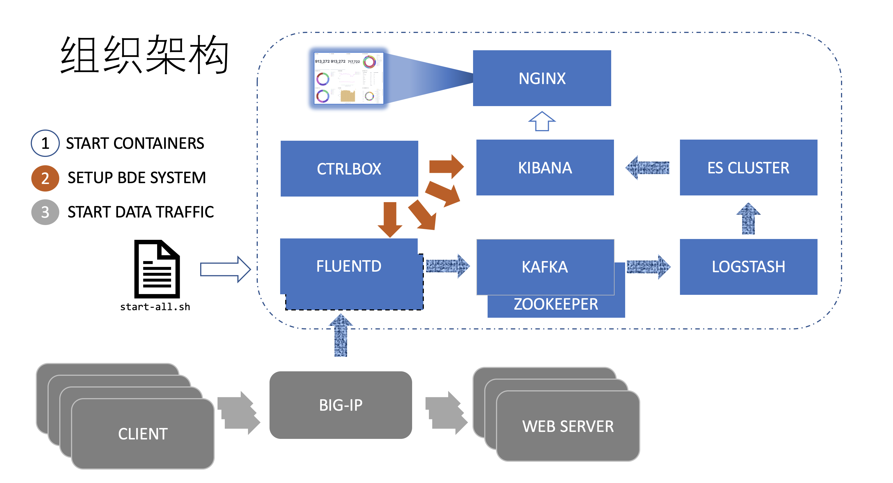

# BDE-OVER-BIGIP

This program works on the **Visualization and Analytics over BIG-IP Data Traffic** by using docker based EFK. 'bde' means Big Data Engine.

The scaling-out is an another story, so performance improving work is on the way.

## Program Architecture



## Running Dependencies

* docker
* docker-compose


## Usage and Workflow

1. Run `start-all.sh`:
   For the first time of running `start-all.sh`, docker command will pull or build images, so it may take a few minutes to finish.

   The `start-all.sh` process do the following 3 things in sequence:
   
   1. Starts the containers: ELASTICSEARCH FLUENTD .. KIBANA and CTRLBOX.
   1. Imports kibana dashboards to KIBANA.
   1. Creates indexs and mappings in ELASTICSEARCH.

2. Setup BIG-IP request logging profile and HSL pool.

   More details about Request Logging Profile configuration(or optional using iRules) on BIG-IP, see .
   
   To collect logs from BIG-IP virtual servers to EFK, manually, BIG-IP admin needs to

   1. Create HSL pool.

      The pool member is the host where EFK program starts. 
      
      The port is 20001.

   1. Create request logging profile using the HSL pool and bind it to the specific virtual server.

      On the request logging profile creation page, left all configuration as default except *Response Setting* -> *Template*: Use the content of `conf.d/request-logging-template.profile`.

3. Discover and View in Dashboard or Do analytics.

   Open Kibana webpage: http://localhost:5601:

   1. Navigate to Discover tab, to view if there are logs comming in.
   1. Navigate to Dashboard tab for visualization.

      The dashboards can be shared thus embedded in customers' web application via iframe.

      Click *share* to find it.
      
   1. Navigate to Machine Learning tab for data analytics.

## BIG-IP Configuration Template

As the "Get Start", there are 3 options for configuring BIG-IP for logging. 

1. Request Logging Profile + HSL (Recommended)

   Copy the content of `conf.d/request-logging-template.profile` to the request logging profile as mentioned above. A standard content may be like:

   ```
      {
      "timestamp": "$DATE_YYYY-$DATE_MM-${DATE_DD}T${TIME_HMS}.000${TIME_OFFSET}",
      "client-ip": "${X-Forwarded-For}", 
      "host": "$Host", 
      "user-agent": "${User-agent}", 
      "cookie": "$Cookie", 
      "method": "$HTTP_METHOD", 
      "uri": "$HTTP_URI", 
      "username": "$Username", 
      "content-type": "${Content-Type}", 
      "server-ip": "$SERVER_IP", 
      "latency": $RESPONSE_MSECS, 
      "status": "$HTTP_STATCODE"
      }
   ```

   Users can customize this configuration based on their own business purpose.

   The profile way has least performance impact to data traffic.

2. iRules + HSL

   There is an example: `conf.d/.logging.irule`. 
   
   Also users can define their own logic and metrics for information collecting.

   The iRule way is more flexible to business scenario. However, users should consider the performance impact during to add (one more) irule for BIG-IP VS configuration.

3. Automation Telemetry Streaming

   This is a new way for metrics collection. 
   
   Users need to install the iControlLX extention to BIG-IP for telemetry streaming.
   
   More information, see here: https://clouddocs.f5.com/products/extensions/f5-telemetry-streaming/latest/

